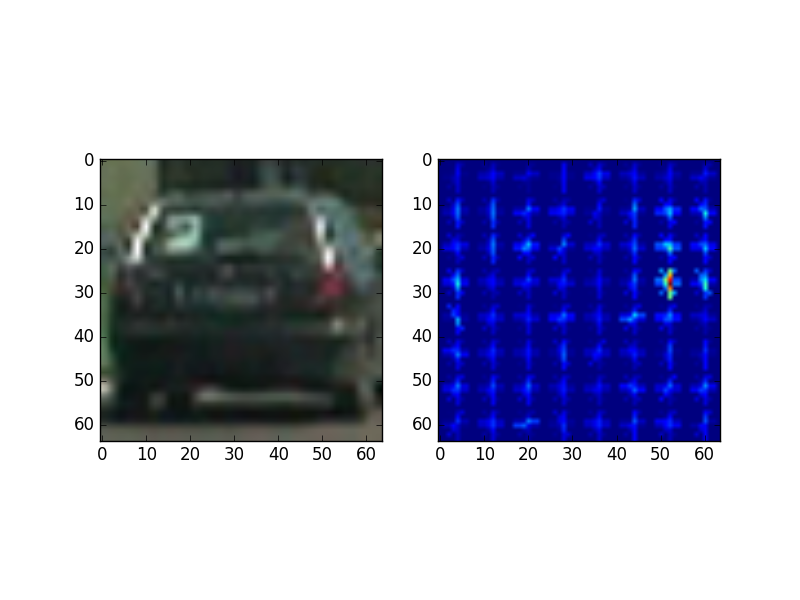
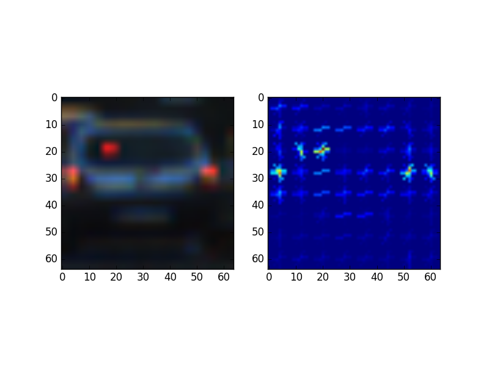
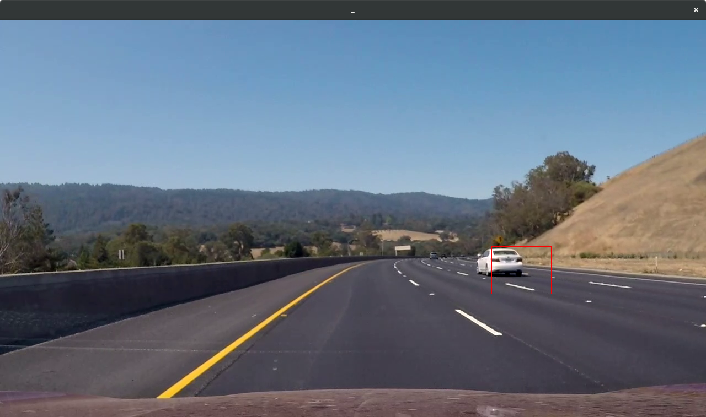
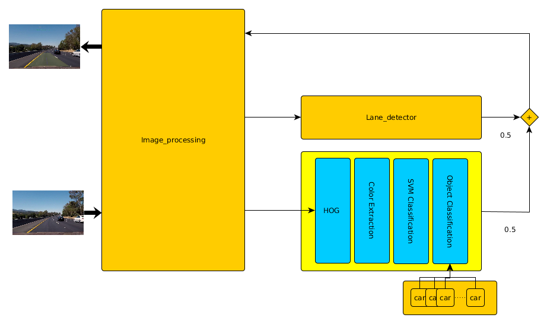
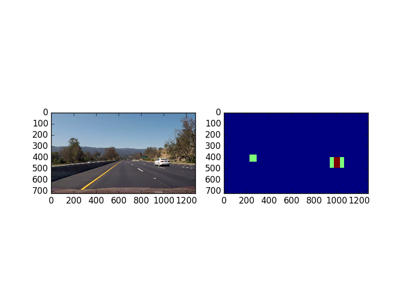
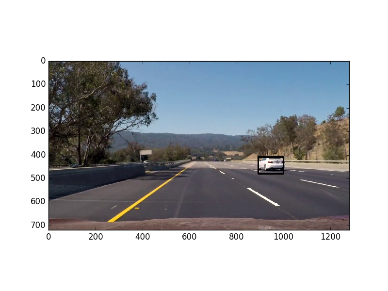

# **Vehicle Detection Project**

The goals / steps of this project are the following:

* Perform a Histogram of Oriented Gradients (HOG) feature extraction on a labeled training set of images and train a classifier Linear SVM classifier
* Apply a color transform and append binned color features, as well as histograms of color, to your HOG feature vector.
* Implement a sliding-window technique and use your trained classifier to search for vehicles in images.
* Run your pipeline on a video stream and create a heat map of recurring detections frame by frame to reject outliers and follow detected vehicles.
* Estimate a bounding box for vehicles detected.
* Join the current project with the find lane lines.

---

### Histogram of Oriented Gradients (HOG)

The HOG features are a great method to extract shape information from images.
In this project we used this method to make a more robust classifier.
The HOG implementation comes from the package `skimage` and the specific parameters
used in this project for the function are as follows:
* orientations = 5
* Pixels per cell = 8
* Cells per block = 4

The values were selected because this way the resulting image has
identifiable features for the human eye, this values were the result of trial an error
experimentation on the vehicle/non-vehicle dataset.

The usage of HOG feature extraction in this project are in the class [`SVM_Classifier::__hog`](https://github.com/yhoazk/CarND-Vehicle-Tracking-P5/blob/master/svm_classifier.py#L219-L226)

And the function is called with the after mentioned parameters in:
[`svm_classifier.py:280`](https://github.com/yhoazk/CarND-Vehicle-Tracking-P5/blob/master/svm_classifier.py#L280)

Here is an example of the features:

Those were the final values for the HOG parameters, I selected them when it reached a 0.98 score in classification,
I think that the HOG parameters play just a part, and maybe not a big one, as the information given by the color histograms
and spatial bins is quite big.

As suggested in class a linear SVC is being used, a different `C=0.001` yield a better
result in my case, at the end of the test the result of the training the accuracy was
near to 98% in the test set.

The classifier was trained on around 17 000 images, both for vehicles and non-vehicles, the classes are
almost even, around 8.5 k for each class (vehicles/non-vehicles), the training is performed in this [section.](https://github.com/yhoazk/CarND-Vehicle-Tracking-P5/blob/master/svm_classifier.py#L343-L360)

In this project all the features were used, HOG, color histograms and binned features, all were concatenated in a single vector,
this vector was then scaled to have a zero mean and unit variance using the [`sklearn.preprocessing.StandardScaler`](https://github.com/yhoazk/CarND-Vehicle-Tracking-P5/blob/master/svm_classifier.py#L369) class.

Then the scaled vector is passed to the LinearSVC and trained, this procedure is done in the [`SVM_Classifier::__extract`](https://github.com/yhoazk/CarND-Vehicle-Tracking-P5/blob/master/svm_classifier.py#L267-L292) method.

### Sliding Window Search

This was also a key part for the result, but a bit of common sense helped me out.
The windowing scheme was selected by analyzing how the classifier was trained.
The images we used to train the classifier are of cars behind almost parallel to
the car itself, and the cars that appear in the video are a bit skewed.

Then we had to make the images given by the windows more like the ones on the
training set, this was done with a rectangular window, rather than a squared, then
a resize of the window to a square to fit the expected shape.

Here is a sample of the windows used:

As the cars in the center of the image will appear as smaller a smaller window is needed.

This is a sample of all the windows in a single image:

The implementation which generated the windows is done in:
[`SVM_Classifier::__get_windows`](https://github.com/yhoazk/CarND-Vehicle-Tracking-P5/blob/master/svm_classifier.py#L163-L190)

### Pipeline

Here is a flow diagram for the pipeline:

Note: This is not at scale.

The work flow is as follows:
1. First, the video library grabs a frame from the input video
    1. The image is [undistorted](https://github.com/yhoazk/CarND-Vehicle-Tracking-P5/blob/master/Vehicle_Tracking.py#L95) to remove the effects of pin-hole lenses.
2. This frame is scaled to get a normalized image using the [`cv2.normalize`](https://github.com/yhoazk/CarND-Vehicle-Tracking-P5/blob/master/Vehicle_Tracking.py#L103) function.
3. The resulting image is passed to the classifier, which selects a portion of the image to
 [extract](https://github.com/yhoazk/CarND-Vehicle-Tracking-P5/blob/master/svm_classifier.py#L368) the HOG and color features.
4. Then the vector is [scaled](https://github.com/yhoazk/CarND-Vehicle-Tracking-P5/blob/master/svm_classifier.py#L369)
5. The scaled vector is the passed to the [predict](https://github.com/yhoazk/CarND-Vehicle-Tracking-P5/blob/master/svm_classifier.py#L370) function to classify it.
6. The steps 3, 4 and 5 are repeated for each window for each frame.
7. As the Video library assumes that the image has values 0-255 to represent the colors, instead from 0-1 the image is
multiplied by 255 to get the colored image.
8. The original image is passed to the lane line class to perform the lane finding algorithm.
9. The Vehicle_Tracking and Lane_lines images are then merged into one and passed to the Video library to assemble the video.

---

### Video Implementation

Here's a [link to my video result](./project_video.mp4)

### Filtering False positives and tracking objects.

This was the most hard part, as we were relying on the `scipy.ndimage.measurements.label()` method to identify the cars, but a new
false positive breaks the labels, then a new class was implemented, the [`CAR`](https://github.com/yhoazk/CarND-Vehicle-Tracking-P5/blob/master/car.py) class.

The `CAR` class implements basic filtering and identification functionalities:
- It tells if a new center of detected object is close to a known object.
- Takes the average of past locations.
- Returns the average and a standard frame rectangle for each identified car.

In the function [`svm_classifier.py:draw_labeled_bboxes`](https://github.com/yhoazk/CarND-Vehicle-Tracking-P5/blob/master/svm_classifier.py#L105-L161) is implemented a per object filtering
whith the next characteristics:

- If an object is not found after 4 frames is deleted.
- A new object is first matched with past objects to check if they are similar,
  this based in location in previous frames.

The information abot the locations comes from a heat map implemented in [`svm_classifier.py::__heat_map`](https://github.com/yhoazk/CarND-Vehicle-Tracking-P5/blob/master/svm_classifier.py#L374-L418), this fuction is pretty much as the one given
in the classroom with a difference that there is also a 3 tap filter implemented with
`cv2.addWeighted` function for 3 different heat maps.

Here is a sample for the resulting heatmap.

---

### Discussion

In this project a SVM was used, at the beginning it was awkward and somewhat strange, how the results didn't make sense as it was classifying a part of
solid color of the pavement as a car, until I realized
that the color was being extracted in a different order and magnitude. Again, I found
myself with the *garbage in garbage out* situation, then the things got better as I
took care of the information coherency at each step.

Another hard situation is how to filter the location from frame to frame using the
labels. The problem is that, if we find a false positive then all the labels are
moved and the locations does not match, the current implementation relies on the
past locations of the object and it performs an "acceptable" for a start, but a better implementation
is sure achievable with bit more experience and time.

In order to make this more robust my first step would be an adaptable windowing scheme.
This scheme will resize the windows according to the horizon and will increase the granularity when it finds an object with a high confidence. For the classifier,
I think that the dataset can be improved as the images are of cars from
behind with little skew, more skewed cars as the ones in the video will improve
the accuracy.

This pipeline will fail in a road where the incoming lanes are not separated by
a wall, even in this scenario, incoming traffic it's being detected introducing
noise, again climate conditions, illumination, different vehicles like Public transport,
trailers and so on are not in the training dataset, also this video is stabilized,
but an unstable image will make all this useless.
