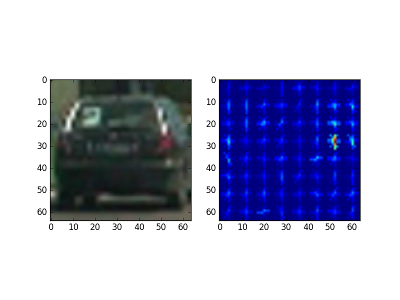
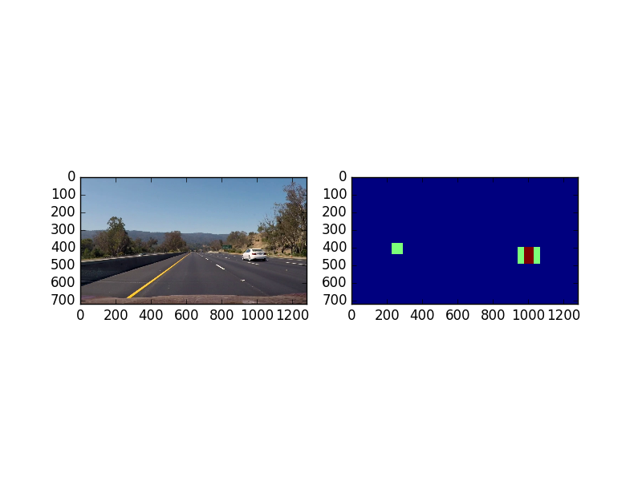

# **Vehicle Detection Project**

The goals / steps of this project are the following:

* Perform a Histogram of Oriented Gradients (HOG) feature extraction on a labeled training set of images and train a classifier Linear SVM classifier
* Apply a color transform and append binned color features, as well as histograms of color, to your HOG feature vector.
* Implement a sliding-window technique and use your trained classifier to search for vehicles in images.
* Run your pipeline on a video stream and create a heat map of recurring detections frame by frame to reject outliers and follow detected vehicles.
* Estimate a bounding box for vehicles detected.
* Join the current project with the find lane lines.

[//]: # (Image References)
[image1]: ./examples/car_not_car.png
[image2]: ./examples/HOG_example.jpg
[image3]: ./examples/sliding_windows.jpg
[image4]: ./examples/sliding_window.jpg
[image5]: ./examples/bboxes_and_heat.png
[image6]: ./examples/labels_map.png
[image7]: ./examples/output_bboxes.png
[video1]: https://youtu.be/OVXSd_9SnSY

## [Rubric](https://review.udacity.com/#!/rubrics/513/view) Points
###Here I will consider the rubric points individually and describe how I addressed each point in my implementation.  

---
### Writeup / README

####1. Provide a Writeup / README that includes all the rubric points and how you addressed each one.  You can submit your writeup as markdown or pdf.  [Here](https://github.com/udacity/CarND-Vehicle-Detection/blob/master/writeup_template.md) is a template writeup for this project you can use as a guide and a starting point.  

You're reading it!

### Histogram of Oriented Gradients (HOG)

####1. Explain how (and identify where in your code) you extracted HOG features from the training images.

The HOG features are a popular method to extract shape information from images.
In this project we used this method to make more robust out classifier.
The HOG implementation comes from the package `skimage` and the specific parameters
used in this project for the function are as follows:
* orientations = 5
* Pixels per cell = 8
* cells_per_block = 4

The values were selected because this way the resulting image still had
identifiable features for the human eye.

The usage in this project are in the class [`SVM_Classifier::__hog`](https://github.com/yhoazk/CarND-Vehicle-Tracking-P5/blob/master/svm_classifier.py#L219-L226)

And the function is called with the aftermentioned parameters in:
[`svm_classifier.py:280`](https://github.com/yhoazk/CarND-Vehicle-Tracking-P5/blob/master/svm_classifier.py#L280)

Here is an example of the features:

I then explored different color spaces and different `skimage.hog()` parameters (`orientations`, `pixels_per_cell`, and `cells_per_block`).  I grabbed random images from each of the two classes and displayed them to get a feel for what the `skimage.hog()` output looks like.

Here is an example using the `YCrCb` color space and HOG parameters of `orientations=8`, `pixels_per_cell=(8, 8)` and `cells_per_block=(2, 2)`:

![alt text][image2]

####2. Explain how you settled on your final choice of HOG parameters.

After getting a good performance with the classifier, the parameters selected are
the next ones, some are the same as in the examples, but other were tweaked, at
the end it was clear that window size and location are also a big part of the algorithm.

####3. Describe how (and identify where in your code) you trained a classifier using your selected HOG features (and color features if you used them).

As suggested in class a linear SVC is being used, a different `C=0.001` yield a better
result in my case, at the end of the test the result of the trainig the accurracy was
near to 98% in the test set.

###Sliding Window Search

####1. Describe how (and identify where in your code) you implemented a sliding window search.  How did you decide what scales to search and how much to overlap windows?

This was also a key part for the result, but a bit of common sense helped me out.
The windowing scheme was selected by analyzing how the classifier was trained.
The images we used to train the classifier are of cars behind almost paralled to
the car itself, and the cars that appear in the video are a bit skewed.

Then we had to make the images given by the windows more like the ones on the
trainig set, this was done with a rectangular window, rather than a squared, then
a resize of the window to a square to fit the expected shape.

Here is a sample of the windows used:

As the cars in the center of the image will appear as smaller a smaller window is needed.

This is a sample of all the windows in a simgle image:

####2. Show some examples of test images to demonstrate how your pipeline is working.  What did you do to optimize the performance of your classifier?

Here is a flow diagram for the pipeline:

Ultimately I searched on two scales using YCrCb 3-channel HOG features plus spatially binned color and histograms of color in the feature vector, which provided a nice result.  Here are some example images:

![alt text][image4]
---

### Video Implementation

####1. Provide a link to your final video output.  Your pipeline should perform reasonably well on the entire project video (somewhat wobbly or unstable bounding boxes are ok as long as you are identifying the vehicles most of the time with minimal false positives.)
Here's a [link to my video result](./project_video.mp4)

#### 2. Describe how (and identify where in your code) you implemented some kind of filter for false positives and some method for combining overlapping bounding boxes.

This was the most dificult part as we were relying on the `scipy.ndimage.measurements.label()` method to identify the cars, but a new
false positive breaks the labels, then a new class was implemented, the [`CAR`](https://github.com/yhoazk/CarND-Vehicle-Tracking-P5/blob/master/car.py) class.

The `CAR` class implements basic filtering and identification functionalities:
- It tells if a new center of detected object is close to a known object.
- Takes the average of past locations.
- Returns the average and a standard frame rectangle for each identified car.

In the function [`svm_classifier.py:draw_labeled_bboxes`](https://github.com/yhoazk/CarND-Vehicle-Tracking-P5/blob/master/svm_classifier.py#L105-L161) is implemented a per object filtering
whith the next characteristics:

- If an object is not found after 4 frames is deleted.
- A new object is first matched with past objects to check if they are similar,
  this based in location in previous frames.

The information abot the locations comes from a heat map implemented in [`svm_classifier.py::__heat_map`](https://github.com/yhoazk/CarND-Vehicle-Tracking-P5/blob/master/svm_classifier.py#L374-L418), this fuction is pretty much as the one given
in the classroom with a difference that there is also a 3 tap filter implemented with
`cv2.addWeighted` function for 3 different heat maps.

Here is a sample for the resulting heatmap.

---

###Discussion

####1. Briefly discuss any problems / issues you faced in your implementation of this project.  Where will your pipeline likely fail?  What could you do to make it more robust?

Here I'll talk about the approach I took, what techniques I used, what worked and why, where the pipeline might fail and how I might improve it if I were going to pursue this project further.  
